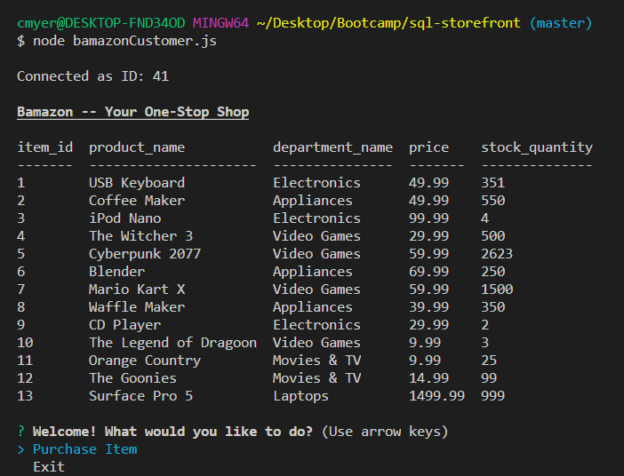
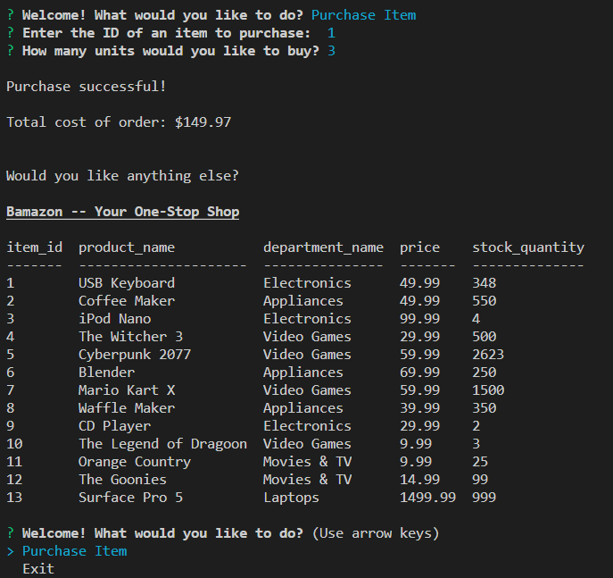
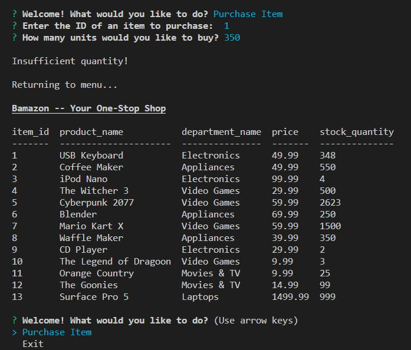
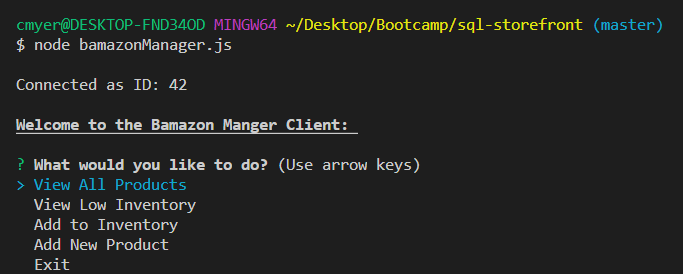
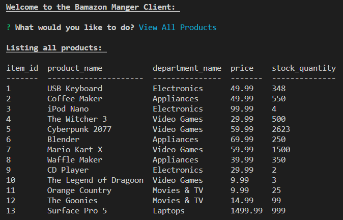
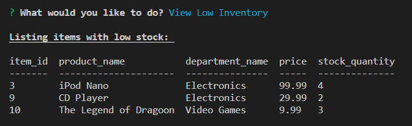
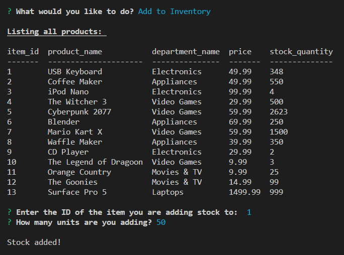
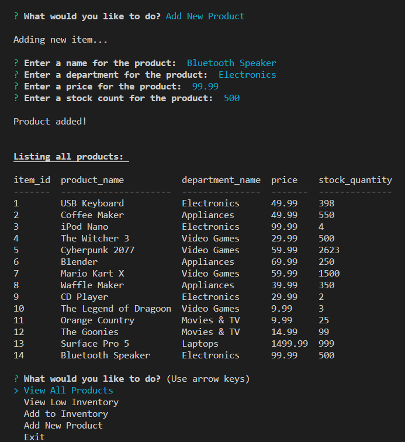

# sql-storefront

Caleb Myers

## Overview

This is a command line application that provides an interface for interacting with "Bamazon", a demo department store. Two programs are available: one for customers, and one for store managers. This application is a prototype for a program that could help a company access and manipulate their database with one easy-to-use interface.

With `bamazonCustomer.js`, customers have access to the "Bamazon" database and can place orders on available products.

When this program is run, users are greeted with a listing of currently available products. Users can then choose to purchase an item or exit the application.

When purchasing items, users must provide the ID for their desired product, which is listed under the column labeled "item_id".

Users must also specify how many units of the item they would like to purchase. If the user tries to purchase more units than there are available, an error will occur and the user will return to the menu. If the purchase is successful, the total price will be shown and the user will return to the menu.

With `bamazonManager.js`, store managers can easily access information about the store's database.

When this program is run, the user is given several options to choose from

* "View All Products"

* "View Low Inventory"

* "Add to Inventory"

* "Add New Product"

Choosing "View All Products" will display a table of all currently available products.

Choosing "View Low Inventory" will display a table of all currently available products with a stock lower than 5. These values are shown under the "stock_quantity" column.

Choosing "Add to Inventory" allows the user to add stock to an available item. The user is prompted to provide the corrosponding item's ID number, and the amount of stock being added.

Choosing "Add New Product" allows the user to add a new item to the database. When adding an item the user will be asked for several pieces of information: the item's name, department, price, and starting stock amount. The name, price, and stock are required. The department will default to "Other" if not provided.

## Examples

#### Customer Page

Opening `bamazonCustomer.js` displays all available items and a main menu.

Choosing "Purchase Item" prompts the user for the item's ID and a purchase amount. After these are provided, the updated list of items is displayed.

If the user attempts to purchase more units of an item than there are available, an error will be displayed.

#### Manager Page

Opening `bamazonManager.js` displays a menu of options to the user.

Choosing "View All Products" displays a table of all available products.

Choosing "View Low Inventory" displays a table of all available products with a stock count lower than 5.

Choosing "Add to Inventory" prompts the user for the item's ID and the amount of units being added to the inventory. After these are provided, the updated list of items is displayed.

.png)

Choosing "Add New Product" prompts the user for several pieces of information about the new product: the name, department, price, and initial stock. After the product is added, the updated list of items is displayed.

## Details

This program utilizes Node.js to run in the command line.

In addition, several NPM packages are used: inquirer, mysql, console.table, and chalk.

**Inquirer** creates the prompts that are easy to navigate, and provide nice aesthetics. This package is used to display menus in both programs, and receive input from the user when purchasing items, adding to inventory, or adding new products.

**MySQL** provides an interface for interacting with a MySQL database. This allows the programs to access and manipulate a database of products that is persistent and accurate.

**Console.table** provides an organized and readable table for displaying the database information.

**Chalk** provides coloring and formatting for console text that add to the aesthetics of the programs.